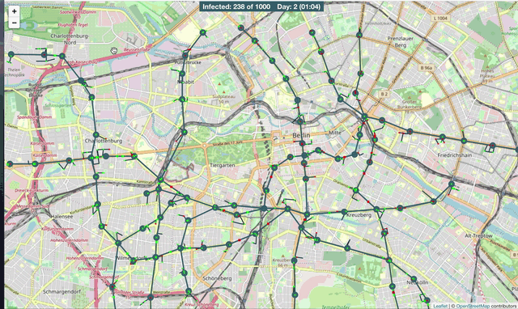

# Wir vs Virus

Hackathon Submission with presentation ([video](https://www.youtube.com/watch?v=g42bADe0gMk&feature=youtu.be)) and [DevPost page](https://devpost.com/software/project-corona-sim).

A city-based epidemic simulation coded in 24h. Using real open-street-maps data to create a simulation environment, simulating daily life by spawning agents at home, home, shopping or leisure places on a SIR basis. Rendered with Leaflet and WebGL shaders.

## Requirements

- NodeJS
- yarn (`npm install -g yarn`) -- The package manager

## Contribution

- Linting and formatting is provided by [Prettier](https://prettier.io/), see `.prettierrc`
- Generally, tabs & spaces, line-endings etc. are configured via `.editorconfig`

We recommend to use respective editor extensions to apply the linting automatically on save. We already provided suitable configurations for the VSCode editor in [.vscode](./.vscode).

## Installation with `yarn install`

Uses the `yarn` packager manager to install all required packages according to `package.json` and `yarn.lock`.

Afterwards, you can use the available scripts described below.

## Adding new packages

You can add new packages to this repository using `yarn add <package-name>`. This will automatically add the dependency to the `package.json` file and list it as a requirement.

## Available Scripts

In the project directory, you can run:

### `yarn start`

Runs the app in the development mode. 
Open [http://localhost:3000](http://localhost:3000) to view it in the browser.

The page will reload if you make edits. 
You will also see any lint errors in the console.

### `yarn test`

Launches the test runner in the interactive watch mode. 
See the section about [running tests](https://facebook.github.io/create-react-app/docs/running-tests) for more information.

### `yarn build`

Builds the app for production to the `build` folder. 
It correctly bundles React in production mode and optimizes the build for the best performance.

The build is minified and the filenames include the hashes. 
Your app is ready to be deployed!

See the section about [deployment](https://facebook.github.io/create-react-app/docs/deployment) for more information.
